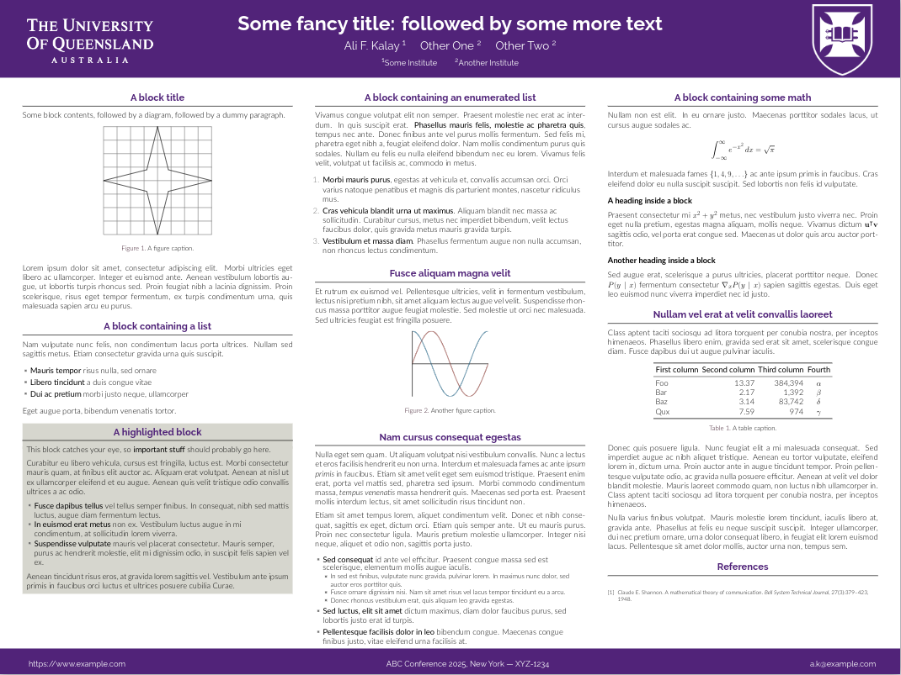

This is a modified [beamerposter](https://ctan.org/pkg/beamerposter?lang=en) template with the East Carolina University logo and colors. It is forked from https://rev.cs.uchicago.edu/alfurka/gemini-uq (which is forked from https://github.com/anishathalye/gemini).

## Screenshot



## ECU RGB

ECU RGB is in file `beamercolorthemeecu.sty` can be re-adjusted. The current RGB code is:

```
\definecolor{ECUmain}{HTML}{592A8A}
```

## Compiling

### TeXShop

Compile it with LuaLaTeX.

### Offline Use

It is a gemini template. More information about dependencies are available here: [Gemini Readme File](https://github.com/alfurka/gemini-uq/blob/master/gemini-readme.md).

1. Copy the files in this repository (or clone the repository)
2. In `main.tex`, set up your paper size, column layout, and scale the content if required.
3. Run `makefile` to build your poster

**Note:** *This is not an official ECU template.*
